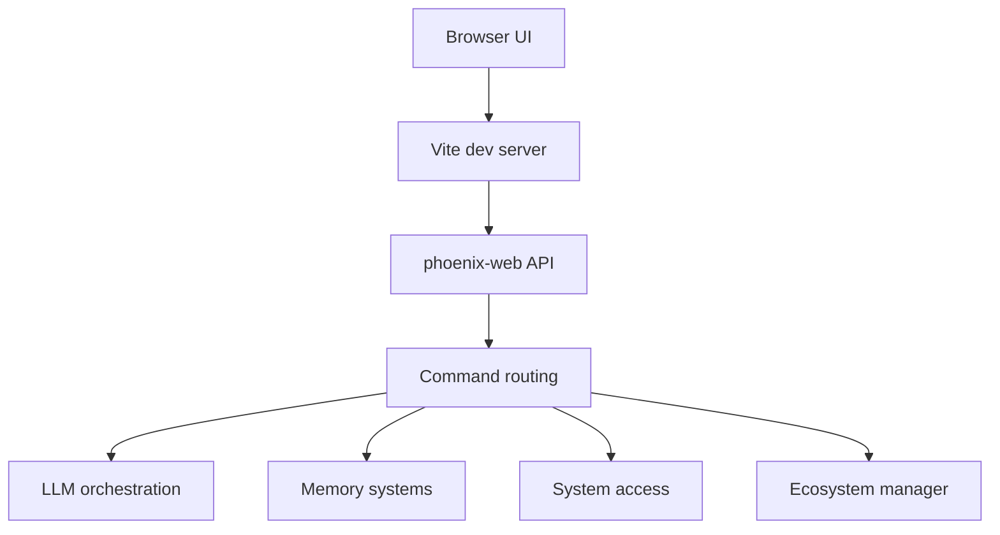

# Phoenix architecture audit + implementation roadmap

This plan consolidates architecture docs and proposes next implementation steps (no code changes).

Primary sources:
- [`README.md`](../README.md)
- [`docs/BACKEND_ARCHITECTURE.md`](../docs/BACKEND_ARCHITECTURE.md)
- [`docs/FRONTEND_UI_ARCHITECTURE.md`](../docs/FRONTEND_UI_ARCHITECTURE.md)
- [`docs/FULL_CONTROL_ACCESS_ARCHITECTURE.md`](../docs/FULL_CONTROL_ACCESS_ARCHITECTURE.md)
- [`docs/FRONTEND_IMPLEMENTATION_SUMMARY.md`](../docs/FRONTEND_IMPLEMENTATION_SUMMARY.md)

## 1) Current architecture (as-is)

### 1.1 System topology

- Frontend: React + TypeScript SPA (Vite dev server; API calls via Vite proxy).
- Backend: `phoenix-web` (Actix-web) providing REST endpoints and command routing.
- Core services (in-process crates): memory (vaults + layered memory + optional vector KB), LLM orchestration, ecosystem manager, system access manager, optional Google integration.

### 1.2 Primary interaction contract

Baseline pattern:
- UI sends a single command string.
- Backend routes by prefix.
- Backend returns a JSON response the UI renders.

Relevant endpoints (see backend + frontend architecture docs):
- `/api/command`, `/api/speak`, `/api/status`, `/health`
- `/api/memory/*` (KV + vector)
- `/api/system/*`
- `/api/ecosystem/*`

## 2) Risks + mismatches discovered

### 2.1 Access model ambiguity (consent vs env var unlock)

The “Full-Control” docs describe Tier 1/Tier 2 activation via environment variables without requiring interactive grants, while also referencing consent models.

Risk:
- UX ambiguity (should UI ask for confirmation?)
- Safety ambiguity (what is the canonical enforcement point: backend gate, frontend confirmation, or both?)

Resolution direction:
- Treat env-var enablement as capability enablement.
- Still require explicit per-action confirmation for Tier 2 exec and destructive Tier 1 operations in the UI, with a clear audit record.

### 2.2 Prompt-injection and research-only instructions

Docs describe optional prompt sections and a `SECRET_AGENDA`-like instruction injection. Even if intended for research, it creates an operational hazard if enabled unintentionally.

Resolution direction:
- Clearly separate “research-only prompt layers” from default operation.
- Prefer compile-time or runtime feature gating + explicit UI indicators when enabled.

### 2.3 Frontend structure divergence

Docs describe a modular `frontend/src/...` structure while current implementation appears closer to a monolith pattern.

Risk:
- Harder to add websockets, shared types, and consistent error handling.

Resolution direction:
- Delay refactor until API contract + security posture are stabilized.

## 3) Minimum stable end-to-end path (baseline definition)

This is the minimum “system is working” bar.

### 3.1 Backend baseline
- `GET /health` returns ok
- `GET /api/status` returns online
- `POST /api/command` accepts a string command and returns a stable JSON envelope

### 3.2 Frontend baseline
- SPA loads via Vite
- Chat view can send and render a message using `/api/command`
- Connection indicator uses `/api/status`

### 3.3 Memory baseline
- KV memory store/get/search/delete works
- Vector KB endpoints are feature-flagged and return “not enabled” in a consistent error envelope

### 3.4 System access baseline
- `/api/system/status` reports tier flags + whether confirmation is required
- Tier 2 exec is never “silent”: it either requires explicit confirmation or is denied

## 4) Prioritized roadmap (approved ordering)

Ordering you approved:
1) Security posture alignment
2) API contract + error envelope
3) WebSocket streaming
4) Frontend refactor

### Milestone A — Security posture alignment (Tier 1/2 + confirmations)

Deliverables:
- Decide canonical security semantics:
  - Tier activation = env vars
  - Execution/destructive operations = explicit user confirmation in UI (and logged)
- Add/standardize audit events for: requested, confirmed, denied, executed.
- Frontend UI indicator of current tier and confirmation requirement.

Acceptance criteria:
- All Tier 2 executions are blocked pending explicit confirmation OR explicitly denied.
- Destructive Tier 1 ops show a confirmation prompt.
- Every such action produces a durable audit record.

### Milestone B — API contract + error envelope

Deliverables:
- Define response envelope for all endpoints:
  - `ok: boolean`
  - `type: string`
  - `data?: object`
  - `error?: { code, message, details? }`
- Ensure `/api/command` and `/api/system/*` conform.

Acceptance criteria:
- Frontend has zero ad-hoc parsing.
- Any failure is renderable via a single UI error path.

### Milestone C — WebSocket streaming (optional but high UX value)

Deliverables:
- Add WS endpoint for:
  - status push
  - streaming chat output (if LLM supports)
- Keep `/api/command` as compatibility baseline.

Acceptance criteria:
- UI can operate in HTTP-only mode.
- UI can switch to WS for streaming when available.

### Milestone D — Frontend refactor into modules

Deliverables:
- Extract backend client + types + hooks out of monolithic file.
- Maintain existing UI/behavior.

Acceptance criteria:
- No functional regressions.
- Reduced file size and improved testability.

## 5) Suggested next code-change targets (no implementation yet)

Backend targets:
- [`phoenix-web/src/main.rs`](../phoenix-web/src/main.rs)

Frontend targets:
- [`frontend/index.tsx`](../frontend/index.tsx)
- [`frontend/devtools.tsx`](../frontend/devtools.tsx)
- [`frontend/vite.config.ts`](../frontend/vite.config.ts)

System access targets:
- [`system_access/src/lib.rs`](../system_access/src/lib.rs)

Docs alignment targets:
- [`docs/FULL_CONTROL_ACCESS_ARCHITECTURE.md`](../docs/FULL_CONTROL_ACCESS_ARCHITECTURE.md)
- [`docs/BACKEND_ARCHITECTURE.md`](../docs/BACKEND_ARCHITECTURE.md)
- [`docs/FRONTEND_UI_ARCHITECTURE.md`](../docs/FRONTEND_UI_ARCHITECTURE.md)
